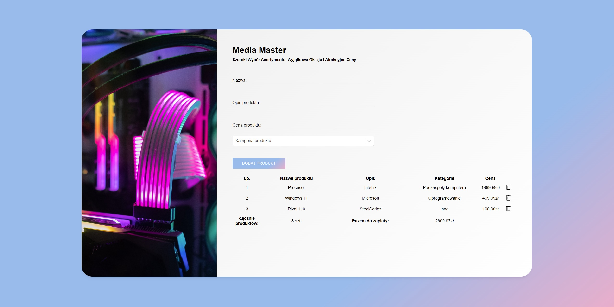

# Media Master

Media Master is pc station builder. Validated form by which You can add product name, describe, category and price is saved in localStorage. For handle this I used Redux-persist. For stylish I used Sass.

## See it live

-   [GitHub](https://github.com/mate966/pc-station-calculator)
-   [GH Pages](https://mate966.github.io/pc-station-calculator/)

## Built With

-   [REACT](https://reactjs.org/)
-   [SASS](https://sass-lang.com/)
-   [Redux-Toolit](https://redux-toolkit.js.org/) - Redux Toolkit with redux-persist to keep data on storage
-   [Redux-persist](https://www.npmjs.com/package/redux-persist) - Persist and rehydrate a redux store.
-   [Redux-select](https://react-select.com/home) - Select Input control for ReactJS.

## Author

-   **Mateusz Szweda** - [Mate](https://github.com/mate966)
